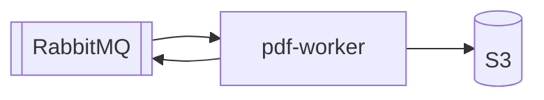

# pdf-worker

NestJS worker that generates comparative PDF reports and stores them in S3.

## Ports

- HTTP health: `3002` → `GET /health`
- Prometheus: `GET /metrics`

```mermaid
flowchart LR
  MQ[[RabbitMQ]] --> PDF[pdf-worker]
  PDF --> S3[(S3)]
  PDF --> MQ
```
